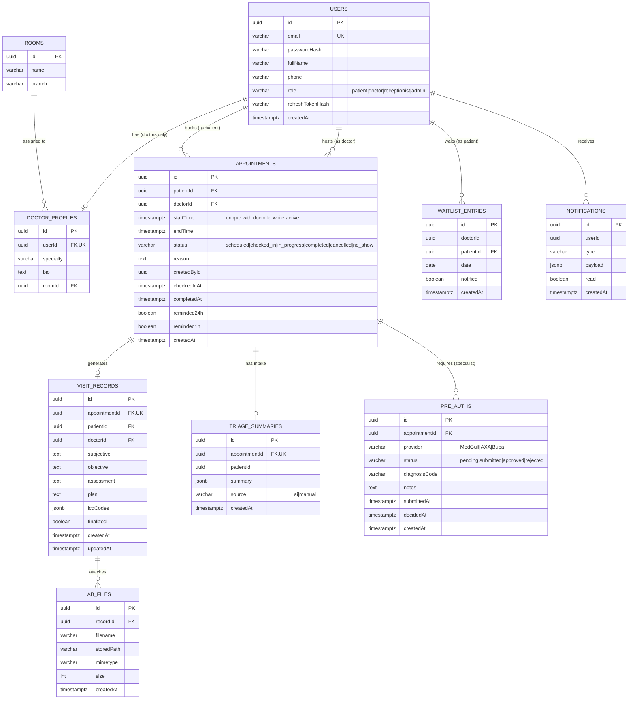

# SmartClinic — Entity-Relationship Diagram

> Reference material generated from the implemented schema
> (`backend/src/entities/`, migration `1720000000000-Init.ts`). Use it to draw /
> verify your own diagram for the System Design Document — per the course spec,
> that document must present your own reasoning.

## Integrity notes

- **Double-booking protection** is at the database level: partial unique index
  `uq_appointments_doctor_slot_active` on `(doctorId, startTime)` where status is
  not `cancelled`/`no_show`, plus a pessimistic-lock transaction in
  `AppointmentsService.create`. A losing concurrent insert receives Postgres
  error 23505 which the API maps to HTTP 409.
- **One visit record / one triage summary per appointment** via unique FKs.
- **Cascade rules**: deleting a user cascades to their appointments and records;
  deleting a room only nulls `doctor_profiles.roomId`.
- **Pre-auth gate**: `VisitRecord.finalized` can only become true for a
  specialist (non-GP) appointment when an `approved` pre_auth row exists —
  enforced in `RecordsService.update`.
